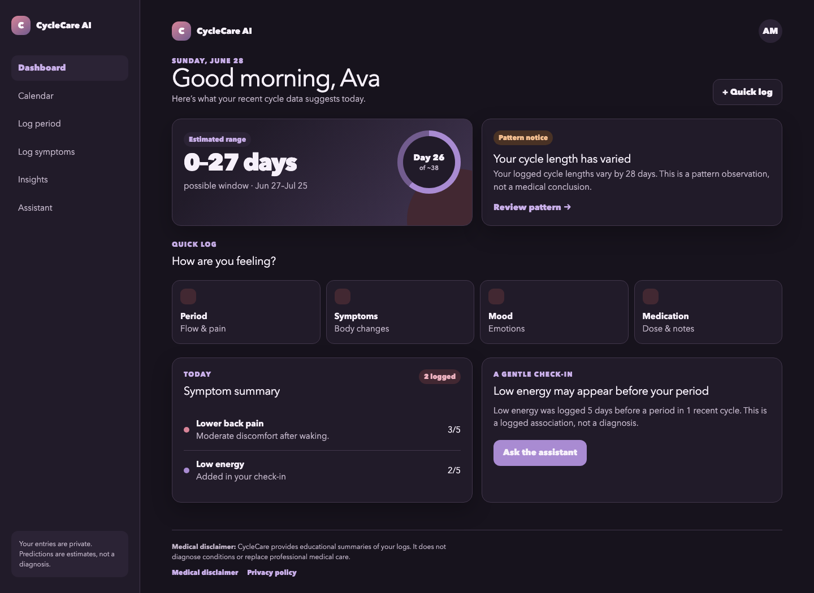
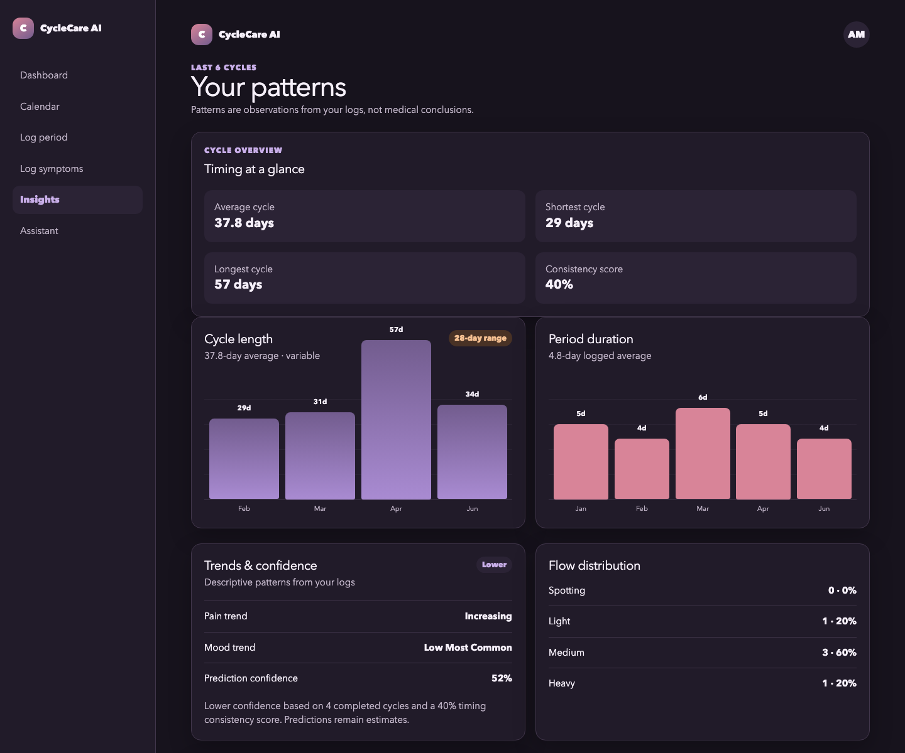

# CycleCare AI

A portfolio-ready cycle health analytics application built with Next.js, TypeScript, Tailwind CSS, Firebase Authentication, and Cloud Firestore.

> CycleCare is an educational portfolio project. It is not a medical device, does not diagnose conditions, and should not be used as contraception or as a substitute for professional medical care.

## Screenshots

### Dashboard



### Insights



## Features

- Private, user-scoped period and symptom logs
- Cycle timing, consistency, pain, mood, flow, and symptom analytics
- Prediction windows with confidence explanations
- Data-aware cycle assistant with Firestore conversation history
- Responsive light and dark themes
- Accessible loading, empty, error, and reduced-motion states
- Medical disclaimer and privacy policy

## Local development

```bash
npm install
cp .env.example .env.local
npm run dev
```

Without Firebase configuration, the app renders fictional portfolio data. Persistent form submissions require Firebase.

## Environment variables

| Variable | Purpose |
| --- | --- |
| `NEXT_PUBLIC_FIREBASE_API_KEY` | Firebase web API key |
| `NEXT_PUBLIC_FIREBASE_AUTH_DOMAIN` | Firebase Auth domain |
| `NEXT_PUBLIC_FIREBASE_PROJECT_ID` | Cloud Firestore project |
| `NEXT_PUBLIC_FIREBASE_STORAGE_BUCKET` | Firebase storage bucket |
| `NEXT_PUBLIC_FIREBASE_MESSAGING_SENDER_ID` | Firebase messaging sender |
| `NEXT_PUBLIC_FIREBASE_APP_ID` | Firebase web application ID |
| `NEXT_PUBLIC_SITE_URL` | Canonical production URL |

Public Firebase web configuration is not an authorization mechanism. Firestore access is enforced by Authentication and the checked-in security rules.

## Firebase setup

1. Create a Firebase web application.
2. Enable Anonymous Authentication under **Authentication → Sign-in method**.
3. Create a Cloud Firestore database.
4. Configure `.env.local` from `.env.example`.
5. Deploy the rules and index manifest:

```bash
firebase deploy --only firestore:rules,firestore:indexes
```

Data is stored under:

```text
users/{userId}/periodLogs
users/{userId}/symptomLogs
users/{userId}/assistantMessages
```

The rules validate ownership and document shape, then deny unmatched access. Current queries use automatic single-field indexes, so `firestore.indexes.json` contains no composite indexes.

## Verification

```bash
npm run lint
npm run build
```

## Deploy to Vercel

Add the Firebase variables to the Production, Preview, and Development environments in Vercel. Then deploy:

```bash
npx vercel link
npx vercel --prod
```

Set `NEXT_PUBLIC_SITE_URL` to the assigned production domain and add that domain to Firebase Authentication’s authorized domains.

## Privacy and safety

- Review the in-app [privacy policy](src/app/privacy/page.tsx) and [medical disclaimer](src/app/medical-disclaimer/page.tsx) before deployment.
- Anonymous accounts may not be recoverable after a user clears browser data.
- Do not represent this portfolio project as HIPAA-compliant or suitable for clinical use without a separate legal, security, infrastructure, and compliance review.
